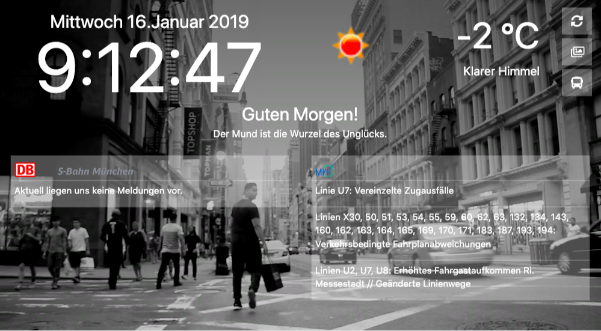
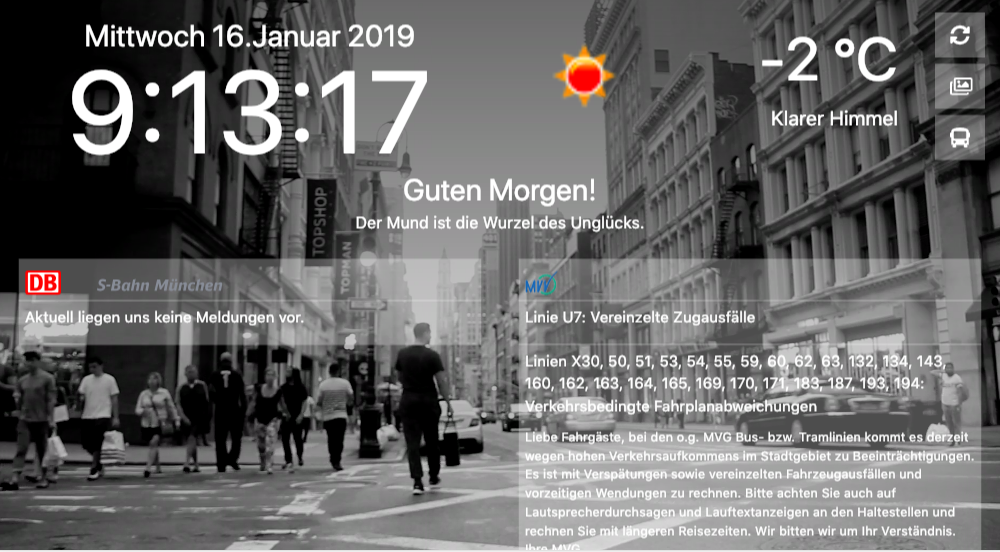
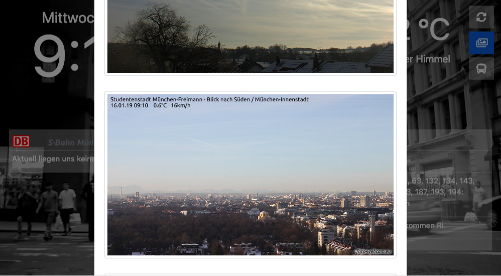
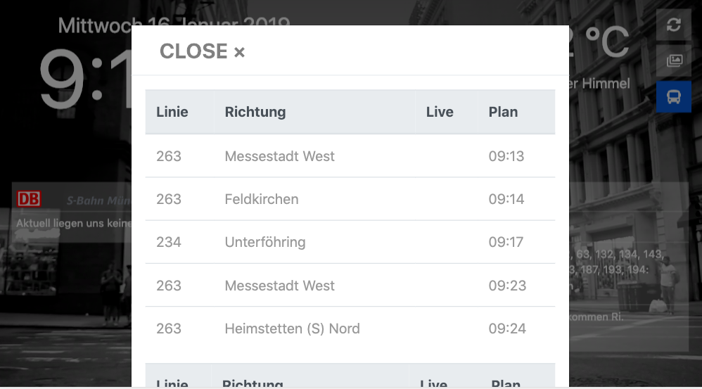

# Nightstand
This is a project for raspberry pi with 7" touch display.

## S-Bahn Data
* Works with Munich S-Bahn
* Train data from: `http://www.s-bahn-muenchen.de/s_muenchen/view/service/aktuelle_betriebslage.shtml`

## U-Bahn Data
* Works only with munichs local MVG/MVV
* Train data from: `https://ticker.mvg.de/`

## Weather Data
* Works only with munich local weather
* Weather data from: `http://openweathermap.org/`
* `You need to get an APIKey`

## Frontend Framework
* Frontend is build fully responsive with twitters bootstrap 4.* framework
* jQuery 3.*
* Fontawesome

## Frontend Build
* Gulp

## Contact
for more infos contact me: `@pmnewmedia`

## Frontend Views
### Default

* This is the default view on your raspberry pi

### Sbahn Data- Message

* This view is if there is some trouble on the munich sbahn (nealy every day^^)

### Weather Image

* Some local weather images, for an overview of the actual weather situation. The images are taken from official and free webcams

### Reatime Traindata values

* Realtime data from selected stations

## Requirements
All you need is a Webserver(Apache, Nginx, ISS, etc..) with PHP5.6+
